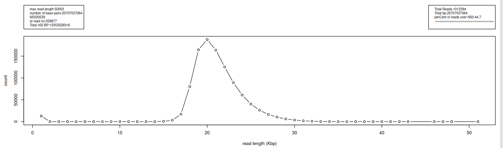

# bioscripts
not quite oneliners but useful and reusable 


[SAM length histogram](#sam_length_histo)

##
### extractfasta
```
usage:
 awk -v reg="chr1" -v from=100 -v to=300 -f extractfasta.awk reffastafile.fa
function:
 extract a sequence from a larger fasta file (a reference), 
 provide the region/chromosome start and stop locations required using awk -v parameters.
notes:
 - use for dotplot etc... 
 - outputs a fasta format to stdout.
 ```
 ###### Standard Bioinformatics tools to do this.
 ```
 samtools:
    samtools faidx chm13v2.fa chr1:20-30
 bedtools:
    bedtools getfasta -fi chm13v2.fa -bed regions.bed -fo results.fasta
 (http://genomespot.blogspot.com/2015/03/extracting-specific-sequences-from-big.html)
```
##
### stat_fas.sh
```
usage:
 bash stat_fas.sh
function:
 get statistics from fasta or fastq sequence data which are gz compressed.
notes:
 - output can be plotted as histogram in plot_stat_fas.R

Sample output for SRR19094308 pacbio hifi WGS of HG002 single cell
```
#####
<details><summary>show Output</summary>
<p>

```ruby
file:   SRR19094308_WGS_of_Hg002_cell_subreads.fastq.gz
max read length:        42183
number of base pairs:   1863081397
N50     10772
at read no:     141468
Total n50 BP:   931544786

Total Reads:    205565
Total bp:       1863081397
perCent of reads over N50:      31.2
 ============================== 
Histogram, units =      1000
1       512
2       1763
3       7730
4       13962
5       16971
6       17580
7       18927
8       19036
9       16996
10      16149
11      14928
12      12707
13      11513
14      8177
15      6272
16      5307
17      5143
18      3019
19      2257
20      1765
21      1357
22      958
23      642
24      487
25      441
26      269
27      231
28      142
29      114
30      70
31      52
32      31
33      16
34      13
35      13
36      8
37      2
38      3
42      1
43      1
```

</p>
</details>

### plot_stat_fas.R
```
usage:
 run in R studio, set path to output from stat_fas.sh
function:
 plots histogram of stat_fas.sh output 
 will try to put all data sets in the folder into one plot
notes:
 - outputs pdf, change 'tofile' parameter in R code to output to panel 
 - panel output may not display, get margins too large error. 
 - NEEDS more work and Refinement! (scaling plots to a nice size, maybe redo with ggplot)
```


##
### hist.awk :: text histogram, numeric and indicative with '*' plot.
```
usage:
  awk -f hist.awk hist.txt 
  OR: awk -v s=1 -f hist.awk hist.txt  (produce slanted output)
  OR: awk -v s=2 -f hist.awk hist.txt  (produce "|" delimited output)
  option: -v x=1 will plot histogram with 2nd highest vlaue as 100% (where highest is much larger tham rest allows histogram resolution of remaining data, highest value will be indicated with "#")
  
function:
 quickly text plot histogram data from stat_Fas data :
```
```ruby

sample input consisits of header lines and lines of (count value) pairs  :
header: max read length:        50003; number of base pairs:   20707037064; N50     20539; at read no:     559877; Total n50 BP:   10353528316; Total Reads:    1012394; Total bp:       20707037064; perCent of reads over N50:      44.7;  ============================== ; Histogram, units =      1000
1       12869
2       30
3       26
4       24
....

notes:
 - turns long stream of data into compact form across terminal screen
 - places a "~" indicatign non continuous data or every tenth value.
```
sample output (from sample output of stat_fas above):
(header is line beining with # or non-numeric.)
```ruby
Header: (one itme per line): max read length:	50003; number of base pairs:	20707037064; N50	20539; at read no:	559877; Total n50 BP:	10353528316; Total Reads:	1012394; Total bp:	20707037064; perCent of reads over N50:	44.7;  ==============================	;Histogram, units =	1000

12345678911111111112222222222333333333344444445
         01234567890123456789012345678901236781
 ..........................................~..~
13221233346792721811118642116329316111741472231
20644626720560497068629006602708743944         
8            262154735181133500181             
6              4314850194163565                
9               848904541941                   
                  1975                         

                 *********                     
                 ********                      
                 *******                       
                 ******                        
                  ****                         
                  ****                         
                  ***                          
                  ***                          
                   *                           
                   *               

```
with s=1 option:
```ruby
Header: (one itme per line): max read length:	50003; number of base pairs:	20707037064; N50	20539; at read no:	559877; Total n50 BP:	10353528316; Total Reads:	1012394; Total bp:	20707037064; perCent of reads over N50:	44.7;  ==============================	;Histogram, units =	1000

1\2\3\4\5\6\7\8\9\1\1\1\1\1\1\1\1\1\1\2\2\2\2\2\2\2\2\2\2\3\3\3\3\3\3\3\3\3\3\4\4\4\4\4\4\4\5\
  \ \ \ \ \ \ \ \ \0\1\2\3\4\5\6\7\8\9\0\1\2\3\4\5\6\7\8\9\0\1\2\3\4\5\6\7\8\9\0\1\2\3\6\7\8\1\
   \.\.\.\.\.\.\.\.\.\.\.\.\.\.\.\.\.\.\.\.\.\.\.\.\.\.\.\.\.\.\.\.\.\.\.\.\.\.\.\.\.\.\~\.\.\~\
   1\3\2\2\1\2\3\3\3\4\6\7\9\2\7\2\1\8\1\1\1\1\8\6\4\2\1\1\6\3\2\9\3\1\6\1\1\1\7\4\1\4\7\2\2\3\1\
    2\0\6\4\4\6\2\6\7\2\0\5\6\0\4\9\7\0\6\8\6\2\9\0\0\6\6\0\2\7\0\8\7\4\3\9\4\4\ \ \ \ \ \ \ \ \ \
     8\ \ \ \ \ \ \ \ \ \ \ \ \2\6\2\1\5\4\7\3\5\1\8\1\1\3\3\5\0\0\1\8\1\ \ \ \ \ \ \ \ \ \ \ \ \ \
      6\ \ \ \ \ \ \ \ \ \ \ \ \ \ \4\3\1\4\8\5\0\1\9\4\1\6\3\5\6\5\ \ \ \ \ \ \ \ \ \ \ \ \ \ \ \ \
       9\ \ \ \ \ \ \ \ \ \ \ \ \ \ \ \8\4\8\9\0\4\5\4\1\9\4\1\ \ \ \ \ \ \ \ \ \ \ \ \ \ \ \ \ \ \ \
         \ \ \ \ \ \ \ \ \ \ \ \ \ \ \ \ \ \1\9\7\5\ \ \ \ \ \ \ \ \ \ \ \ \ \ \ \ \ \ \ \ \ \ \ \ \ \
         
           \ \ \ \ \ \ \ \ \ \ \ \ \ \ \ \ \*\*\*\*\*\*\*\*\*\ \ \ \ \ \ \ \ \ \ \ \ \ \ \ \ \ \ \ \ \ \
            \ \ \ \ \ \ \ \ \ \ \ \ \ \ \ \ \*\*\*\*\*\*\*\*\ \ \ \ \ \ \ \ \ \ \ \ \ \ \ \ \ \ \ \ \ \ \
             \ \ \ \ \ \ \ \ \ \ \ \ \ \ \ \ \*\*\*\*\*\*\*\ \ \ \ \ \ \ \ \ \ \ \ \ \ \ \ \ \ \ \ \ \ \ \
              \ \ \ \ \ \ \ \ \ \ \ \ \ \ \ \ \*\*\*\*\*\*\ \ \ \ \ \ \ \ \ \ \ \ \ \ \ \ \ \ \ \ \ \ \ \ \
               \ \ \ \ \ \ \ \ \ \ \ \ \ \ \ \ \ \*\*\*\*\ \ \ \ \ \ \ \ \ \ \ \ \ \ \ \ \ \ \ \ \ \ \ \ \ \
                \ \ \ \ \ \ \ \ \ \ \ \ \ \ \ \ \ \*\*\*\*\ \ \ \ \ \ \ \ \ \ \ \ \ \ \ \ \ \ \ \ \ \ \ \ \ \
                 \ \ \ \ \ \ \ \ \ \ \ \ \ \ \ \ \ \*\*\*\ \ \ \ \ \ \ \ \ \ \ \ \ \ \ \ \ \ \ \ \ \ \ \ \ \ \
                  \ \ \ \ \ \ \ \ \ \ \ \ \ \ \ \ \ \*\*\*\ \ \ \ \ \ \ \ \ \ \ \ \ \ \ \ \ \ \ \ \ \ \ \ \ \ \
                   \ \ \ \ \ \ \ \ \ \ \ \ \ \ \ \ \ \ \*\ \ \ \ \ \ \ \ \ \ \ \ \ \ \ \ \ \ \ \ \ \ \ \ \ \ \ \
                    \ \ \ \ \ \ \ \ \ \ \ \ \ \ \ \ \ \ \*\ \ \ \ \ \ \ \ \ \ \ \ \ \ \ \ \ \ \ \ \ \ \ \ \ \ \ \

```
with -v s=2 option :
```ruby
1|2|3|4|5|6|7|8|9|1|1|1|1|1|1|1|1|1|1|2|2|2|2|2|2|2|2|2|2|3|3|3|3|3|3|3|3|3|3|4|4|4|4|4|4|4|5|
 | | | | | | | | |0|1|2|3|4|5|6|7|8|9|0|1|2|3|4|5|6|7|8|9|0|1|2|3|4|5|6|7|8|9|0|1|2|3|6|7|8|1|
 |.|.|.|.|.|.|.|.|.|.|.|.|.|.|.|.|.|.|.|.|.|.|.|.|.|.|.|.|.|.|.|.|.|.|.|.|.|.|.|.|.|.|~|.|.|~|
1|3|2|2|1|2|3|3|3|4|6|7|9|2|7|2|1|8|1|1|1|1|8|6|4|2|1|1|6|3|2|9|3|1|6|1|1|1|7|4|1|4|7|2|2|3|1|
2|0|6|4|4|6|2|6|7|2|0|5|6|0|4|9|7|0|6|8|6|2|9|0|0|6|6|0|2|7|0|8|7|4|3|9|4|4| | | | | | | | | |
8| | | | | | | | | | | | |2|6|2|1|5|4|7|3|5|1|8|1|1|3|3|5|0|0|1|8|1| | | | | | | | | | | | | |
6| | | | | | | | | | | | | | |4|3|1|4|8|5|0|1|9|4|1|6|3|5|6|5| | | | | | | | | | | | | | | | |
9| | | | | | | | | | | | | | | |8|4|8|9|0|4|5|4|1|9|4|1| | | | | | | | | | | | | | | | | | | |
 | | | | | | | | | | | | | | | | | |1|9|7|5| | | | | | | | | | | | | | | | | | | | | | | | | |

 | | | | | | | | | | | | | | | | |*|*|*|*|*|*|*|*|*| | | | | | | | | | | | | | | | | | | | | |
 | | | | | | | | | | | | | | | | |*|*|*|*|*|*|*|*| | | | | | | | | | | | | | | | | | | | | | |
 | | | | | | | | | | | | | | | | |*|*|*|*|*|*|*| | | | | | | | | | | | | | | | | | | | | | | |
 | | | | | | | | | | | | | | | | |*|*|*|*|*|*| | | | | | | | | | | | | | | | | | | | | | | | |
 | | | | | | | | | | | | | | | | | |*|*|*|*| | | | | | | | | | | | | | | | | | | | | | | | | |
 | | | | | | | | | | | | | | | | | |*|*|*|*| | | | | | | | | | | | | | | | | | | | | | | | | |
 | | | | | | | | | | | | | | | | | |*|*|*| | | | | | | | | | | | | | | | | | | | | | | | | | |
 | | | | | | | | | | | | | | | | | |*|*|*| | | | | | | | | | | | | | | | | | | | | | | | | | |
 | | | | | | | | | | | | | | | | | | |*| | | | | | | | | | | | | | | | | | | | | | | | | | | |
 | | | | | | | | | | | | | | | | | | |*| | | | | | | | | | | | | | | | | | | | | | | | | | | |

```
with -v x=1 option:
```ruby
12345678911111111112222222222333333333344444445
         01234567890123456789012345678901236781
 ..........................................~..~
13221233346792721811118642116329316111741472231
20644626720560497068629006602708743944         
8            262154735181133500181             
6              4314850194163565                
9               848904541941                   
                  1975                         

                ***#*******                    
                 **#*****                      
                 **#****                       
                 **#***                        
                  *#***                        
                  *#**                         
                  *#**                         
                  *#*                          
                  *#*                          
                  *#*                          
index max  51  count max  187899  count c2max (2nd highest) :  163507  elements:  47

```
<a name="sam_length_histo"></a>
### sam_length_Hist.sh
Takes a sam bam file as input and gets lengths of reads, stratifies them and give a "count - value" histogram output.
```ruby
Stratification
 0 -> 0
 1..9 -> 1..9
 10-19 -> 10
 30-39 -> 30
 100-199 -> 100
 400-499 -> 400
 1000-1999 -> 1000
 10000-19999 -> 10000
 20000-29999 -> 20000
 etc..
 
 Sample output:  (count, value)  [bash sam_length_Hist.sh  MchrSample.sam | less]
      1 200
      3 300
      2 400
      5 800
      4 900
     12 1000
      7 2000
      3 7000
      5 8000
      7 9000
    139 10000

 ```
